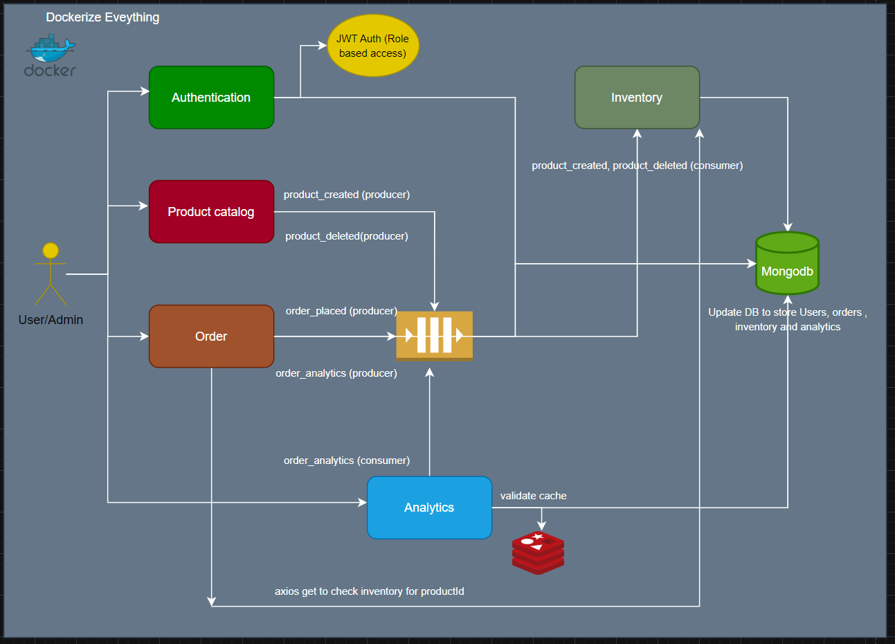

# 🧾 Order Management System – Microservices Architecture

This is a production-grade microservices-based backend system built with Node.js, MongoDB, RabbitMQ, Redis, and Docker. It simulates a real-world scalable e-commerce order platform.

---

## 📦 Tech Stack

- *Node.js* + *Express.js*
- *MongoDB*
- *Redis* (used by Analytics Service)
- *RabbitMQ* (event-driven communication)
- *JWT Authentication*
- *Docker & Docker Compose*

---

## 🗺 System Architecture Overview



> This diagram shows the interaction between services, databases, and RabbitMQ for event-driven communication.


---

## 🧩 Microservices Overview

| Service                | Port | Description                                       |
|------------------------|------|-------------------------------------------------- |
| *Auth Service*         | 5000 | User registration, login, and JWT handling        |
| *Product Service*      | 8000 | Product CRUD                                      |
| *Inventory Service*    | 8080 | Inventory adjustments on product/order events     |
| *Order Service*        | 3000 | Order placement, emits events                     |
| *Notification Service* | 5005 | Listens to events like ORDER_PLACED, sends alerts |
| *Analytics Service*    | 5006 | Aggregates metrics using Redis                    |
| *MongoDB*              | 27017| Database for each service                         |
| *RabbitMQ*             | 5672 / 15672 | Message broker + dashboard                |

## Authorization:- 
> JWT access token for route protection, refresh tokens via HTTP-only cookies, Role based access control
---

## Future Enhancements
> Add API Gateway
> CI/CD with github actions
> Centralized logs and tracing (ELK, Jaeger)
> Service discovery with Consul or Eureka
> Create a minimal UI using Angular

## 🐳 Docker Setup

```bash
git clone https://github.com/harsh2308-agr/order-management.git
cd order-management
docker-compose up -d